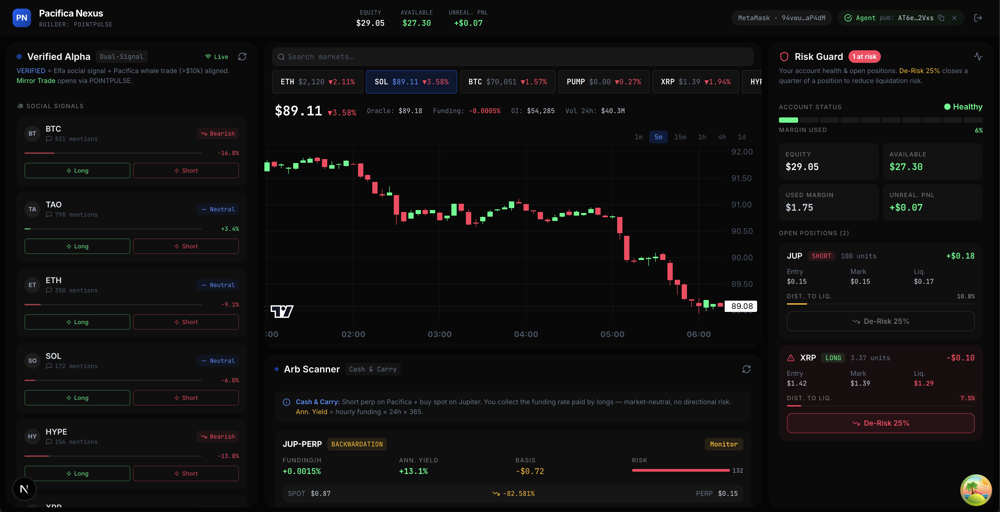

# Pacifica Nexus — Alpha Terminal



## What Is This?

Pacifica Nexus is a **professional trading terminal** built on top of the Pacifica Perpetual DEX on Solana. It is designed for traders who want more signal and less noise — combining real-time perpetual market data, large-trade whale detection, social trend analysis, and automated funding-rate arbitrage discovery into a single glassmorphic interface.

Built for the **Pacifica Hackathon** under builder code **Pacifica-Nexus**.

---

## Features

### Verified Alpha Feed (Left Panel)

- **Dual-Signal Engine**: Matches Elfa AI trending tokens (social layer) against Pacifica WebSocket whale trades (≥ $10,000 notional) in real time.
- A signal is marked **VERIFIED** only when both the social sentiment (BULLISH/BEARISH) and the whale trade direction (LONG/SHORT) agree on the same asset.
- Unverified social signals are shown below as pending — useful context even without whale confirmation.
- **Mirror Trade CTA**: One-click to open the same position as the whale, with a pre-filled confirmation modal.
- Confidence score (0–100) based on mention volume, sentiment strength, and whale size.

### Price Chart (Center — Top)

- Real-time candlestick chart powered by [Lightweight Charts](https://tradingview.github.io/lightweight-charts/) with Pacifica kline data.
- Supports 1m, 5m, 15m, 1h, 4h, 1d intervals with automatic lookback windows.
- Searchable market tabs — all Pacifica perp markets, scrollable with live mark price and 24h change.
- Stats row: mark price, oracle price, funding rate, open interest, 24h volume.
- Mouse drag to pan, scroll to zoom, touch pinch supported.

### Arb Scanner (Center — Bottom)

- **Cash & Carry Strategy**: Identifies funding rate arbitrage opportunities across all Pacifica markets.
- Compares Pacifica perpetual funding rates against Jupiter spot prices.
- Annualizes funding rates (`hourly rate × 24 × 365`) and scores each opportunity by yield and risk.
- Recommendations: **OPEN** (≥15% APY, low risk), **MONITOR** (≥8% APY), or **AVOID**.
- APY > 15% shown with neon green glow for instant visibility.
- One-click hedge: shorts the perp on Pacifica + opens Jupiter in a new tab for the spot leg.

### Risk Guard (Right Panel)

- Real-time account health with a 10-segment color-coded margin bar (green → amber → red).
- Per-position breakdown: entry price, mark price, liquidation price, unrealized P&L.
- Distance-to-liquidation progress bar with red glow when < 10% away.
- **De-Risk 25%**: One-click reduce-only order that trims 25% of any endangered position.
- Positions at risk pulse with a danger-colored card background.

---

## Architecture Overview

```
┌─────────────────────────────────────────────────────────────┐
│                      Next.js App Router                      │
│  app/layout.tsx → PrivyProvider → SolanaWalletProvider      │
│               → QueryProvider → NexusDashboard              │
└──────────┬──────────────────────────────────────────────────┘
           │
           ├── SessionBar (wallet + agent key management)
           │
           ├── AlphaFeed ← useWhaleStream
           │                  ├── Elfa AI REST (60s poll, 10min TTL)
           │                  └── Pacifica WebSocket (live, $10k+ filter)
           │
           ├── PriceChart ← usePacifica (markets)
           │                  └── Pacifica REST /kline (10–30s poll)
           │
           ├── ArbScanner ← useArbScanner
           │                  ├── Pacifica REST /info/prices (3s poll)
           │                  └── Jupiter Price API (3s poll)
           │
           └── RiskGuard ← usePacifica
                              ├── /positions (3s poll)
                              ├── /account (5s poll)
                              └── POST /orders/create_market (De-Risk)
```

### Data Flow

**Authentication:**

```
User connects wallet → imports agent key (base58) from app.pacifica.fi/apikey
  → registerAgentKey() signs once with main wallet → agent key authorized
  → approveBuilderCode() signs once → Pacifica-Nexus builder fee enabled
  → All future orders signed automatically by agent key (no popups)
```

**Trading:**

```
User clicks Confirm
  → buildSignedBody("create_market_order", payload, agentKeypair)
  → POST /orders/create_market { symbol, side, amount, slippage, builder_code: "Pacifica-Nexus" }
  → Response: { order_id }
  → React Query invalidates positions + orders + health → UI updates
```

**Whale Matching:**

```
Elfa API trending token → AlphaSocialSignal (sentimentScore, volumeScore)
Pacifica WS trade event → WhaleEvent if notional ≥ $10,000
tryMatch(): signal.direction === whale.side? → VerifiedAlpha (confidence score)
```

---

## Tech Stack

| Layer            | Technology                                          |
| ---------------- | --------------------------------------------------- |
| Framework        | Next.js 14 (App Router, `force-dynamic`)            |
| UI               | React 18, Tailwind CSS 3, Lucide Icons              |
| Charts           | Lightweight Charts 4 (TradingView)                  |
| State / Fetching | TanStack React Query 5                              |
| Wallet           | Solana Wallet Adapter (Phantom, MetaMask, Solflare) |
| Signing          | TweetNaCl + bs58 (agent keypair signing)            |
| Social Data      | Elfa AI v2 API                                      |
| Spot Prices      | Jupiter Price API v6                                |
| Perp Data        | Pacifica REST + WebSocket                           |

---

## Project Structure

```
├── app/
│   ├── layout.tsx          # Provider stack: Privy → Solana → Query
│   ├── page.tsx            # Entry: renders NexusDashboard
│   └── globals.css         # Glass panel, button, animation utilities
│
├── src/
│   ├── components/
│   │   ├── providers/
│   │   │   ├── PrivyProvider.tsx
│   │   │   ├── QueryProvider.tsx
│   │   │   └── SolanaWalletProvider.tsx
│   │   └── terminal/
│   │       ├── NexusDashboard.tsx    # Three-column grid layout
│   │       ├── SessionBar.tsx        # Header: wallet + agent key
│   │       ├── AlphaFeed.tsx         # Left: dual-signal alpha cards
│   │       ├── PriceChart.tsx        # Center top: candlestick chart
│   │       ├── ArbScanner.tsx        # Center bottom: funding arb
│   │       ├── RiskGuard.tsx         # Right: positions + health
│   │       └── TradeConfirmModal.tsx # Trade confirmation dialog
│   │
│   ├── hooks/
│   │   ├── usePacifica.ts      # Core: markets, positions, trading
│   │   ├── useArbScanner.ts    # Funding rate vs spot arb engine
│   │   └── useWhaleStream.ts   # Dual-signal: Elfa + WS whales
│   │
│   ├── lib/
│   │   ├── pacifica-client.ts  # Pacifica REST API client (singleton)
│   │   ├── elfa-client.ts      # Elfa AI API client
│   │   ├── signing.ts          # Agent key import, keypair signing
│   │   ├── privy.ts            # Privy config
│   │   └── utils.ts            # formatUSD, formatPct, cn, truncateAddress
│   │
│   └── types/
│       └── index.ts            # All TypeScript types
│
├── public/
│   └── image.png              # Terminal screenshot
│
├── .env.local                 # Environment variables (see below)
├── tailwind.config.ts         # Custom colors, fonts, animations
└── next.config.ts             # Next.js config
```

---

## Getting Started

### Prerequisites

- Node.js 18+
- A Solana wallet (Phantom recommended)
- A Pacifica account with an agent key (create at [app.pacifica.fi/apikey](https://app.pacifica.fi/apikey))
- Elfa AI API key (apply at [elfa.ai](https://elfa.ai))

### 1. Clone and Install

```bash
git clone https://github.com/gitshreevatsa/Pacifica-Nexus.git
cd Pacifica-Hackathon
npm install
```

### 2. Configure Environment Variables

Create a `.env.local` file in the root:

```env
# ─── Privy (Wallet Auth) ──────────────────────────────────────────────────────
NEXT_PUBLIC_PRIVY_APP_ID=your_privy_app_id
PRIVY_APP_SECRET=your_privy_app_secret

# ─── Elfa AI (Social Signals) ────────────────────────────────────────────────
ELFA_AI_API_KEY=your_elfa_api_key
NEXT_PUBLIC_ELFA_AI_BASE_URL=https://api.elfa.ai/v1

# ─── Pacifica DEX ────────────────────────────────────────────────────────────
NEXT_PUBLIC_PACIFICA_WS_URL=wss://ws.pacifica.fi/ws
NEXT_PUBLIC_PACIFICA_API_URL=https://api.pacifica.fi/api/v1

# ─── Jupiter (Spot Prices for Arb Scanner) ───────────────────────────────────
NEXT_PUBLIC_JUPITER_PRICE_API=https://price.jup.ag/v6/price

# ─── Builder Code (do not change) ────────────────────────────────────────────
NEXT_PUBLIC_BUILDER_CODE=Pacifica-Nexus
```

| Variable                   | Where to get it                                           |
| -------------------------- | --------------------------------------------------------- |
| `NEXT_PUBLIC_PRIVY_APP_ID` | [console.privy.io](https://console.privy.io) → Create App |
| `PRIVY_APP_SECRET`         | Privy dashboard → API Keys                                |
| `ELFA_AI_API_KEY`          | [elfa.ai](https://elfa.ai) → API Access                   |
| Pacifica URLs              | Fixed — do not change                                     |
| Jupiter URL                | Fixed — do not change                                     |

### 3. Run Development Server

```bash
npm run dev
```

Open [http://localhost:3000](http://localhost:3000).

### 4. Build for Production

```bash
npm run build
npm run start
```

---

## First-Time Setup (In-App)

When you first load the terminal:

1. **Connect Wallet** — Click "Connect Wallet" in the top bar. Select Phantom or your preferred wallet.

2. **Import Agent Key** — Click "Agent Key" in the top bar.
   - Go to [app.pacifica.fi/apikey](https://app.pacifica.fi/apikey)
   - Create a new agent key
   - Copy the **private key** (base58 format)
   - Paste it into the terminal modal
   - The terminal stores it in `sessionStorage` only — it never leaves your browser

3. **Authorize Agent Key** — A yellow banner will appear asking you to sign once with your main wallet. This registers your agent key with Pacifica (one-time).

4. **Approve Builder Code** — A blue banner will appear asking you to approve Pacifica-Nexus. Sign once. This enables trading rewards (one-time).

5. **You're live.** The terminal will begin loading your positions, account health, and market data.

---

## How to Use Each Panel

### Alpha Feed (Left)

- **Verified Alpha cards** at the top are the highest-confidence signals — both social + whale agree.
- **Social Signals** below show Elfa AI trending tokens. Green = bullish mentions growing, red = bearish.
- Click **Mirror Trade** on a Verified Alpha to open a pre-filled trade modal.
- Click **Long** or **Short** on any social card to open a position in that direction.

### Price Chart (Center Top)

- **Search** tokens in the search bar above the tabs.
- Click any **token tab** to switch markets.
- Use **interval buttons** (1m, 5m, 15m, 1h, 4h, 1d) on the right.
- **Drag** the chart to pan history. **Scroll** to zoom in/out.

### Arb Scanner (Center Bottom)

- Markets are sorted by annualized yield.
- **APY > 15%** glows neon green — these are the best cash-and-carry opportunities.
- Click **Open Hedge** on any OPEN or MONITOR row.
- The confirmation modal shows the perp trade details. On confirm:
  - The short perp order is placed on Pacifica automatically.
  - Jupiter opens in a new tab so you can buy the spot leg manually.

### Risk Guard (Right)

- The **margin bar** at the top shows your overall account health (green = safe, red = critical).
- Each open position shows entry, mark, and liquidation prices.
- The **Dist. to Liq.** bar shows how close you are to liquidation.
- Click **De-Risk 25%** on any position to automatically reduce it by 25% (reduce-only market order).

---

## API Reference

All Pacifica API calls go through `src/lib/pacifica-client.ts`.

### Public Endpoints (No Auth)

| Endpoint                  | Purpose                                               |
| ------------------------- | ----------------------------------------------------- |
| `GET /info`               | Market metadata (tick size, leverage, min order size) |
| `GET /info/prices`        | Live mark prices, funding rates, open interest        |
| `GET /kline`              | Historical candle data                                |
| `GET /account?account=`   | Account equity and margin                             |
| `GET /positions?account=` | Open positions                                        |
| `GET /orders?account=`    | Open orders                                           |

### Authenticated Endpoints (Signed Requests)

| Endpoint                              | Signer      | Purpose                     |
| ------------------------------------- | ----------- | --------------------------- |
| `POST /agent/bind`                    | Main wallet | Register agent key (once)   |
| `POST /account/builder_codes/approve` | Main wallet | Approve builder code (once) |
| `POST /orders/create_market`          | Agent key   | Place market order          |
| `POST /orders/create`                 | Agent key   | Place limit order           |
| `POST /orders/cancel`                 | Agent key   | Cancel order                |

Signed requests include: `type`, `main_wallet`, `agent_wallet`, `timestamp`, `expiry`, `signature` (Ed25519 over sorted JSON).

---

## Key Design Decisions

**Agent Keys over Wallet Popups**
Every order goes through the agent keypair stored in `sessionStorage`. Users sign once to authorize the agent key, then trade without any wallet popups. The agent key can only trade — it cannot withdraw funds.

**Builder Code (Pacifica-Nexus)**
Every market order includes `builder_code: "Pacifica-Nexus"`. This enrolls users in Pacifica's builder rewards program. Approval is a one-time wallet signature.

**Dual-Signal Filter**
Social signals without whale confirmation are displayed but clearly marked as unverified. This prevents acting on pure social noise. A trade is only surfaced as "Verified Alpha" when at least one $10k+ on-chain trade confirms the social direction.

**Cash & Carry Neutrality**
The arb scanner only suggests market-neutral positions — short the perp (collect funding), long the spot (delta hedge). There is no directional exposure. Risk scores account for basis spread volatility.

---

## Development Scripts

```bash
npm run dev          # Start local dev server (localhost:3000)
npm run build        # Production build
npm run start        # Run production build locally
npm run lint         # ESLint check
npm run type-check   # TypeScript check (no emit)
```

---

## Environment Notes

- The app uses `export const dynamic = "force-dynamic"` on the page — this prevents static pre-rendering which would break Privy initialization.
- Agent keys are stored in `sessionStorage` — they are cleared when the browser tab is closed. This is intentional for security.
- WebSocket reconnects with exponential backoff (2s → 30s max). Social signals continue working even if the WebSocket is offline.
- All monetary values are in USD. Pacifica uses USDC as collateral.

---

## License

Copyright (c) 2025 Pacifica-Nexus. All rights reserved.

This software and its source code are proprietary and confidential. No part of this codebase — including but not limited to the source code, architecture, algorithms, UI design, and data flows — may be copied, reproduced, distributed, modified, reverse-engineered, or used to create derivative works, in whole or in part, without the express prior written permission of the owner.

Unauthorized use, duplication, or distribution of this software is strictly prohibited and may result in severe civil and criminal penalties.
